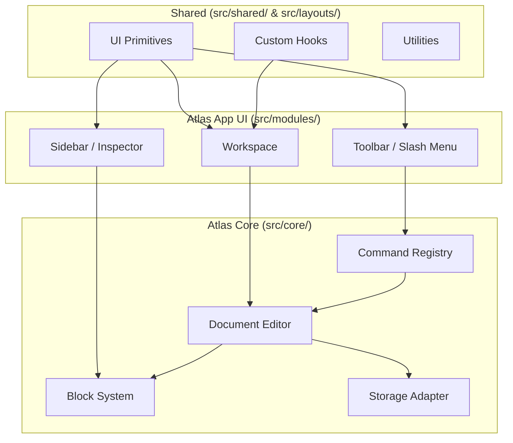

# Architecture

This document describes the high-level architecture of Atlas, its design principles, and the rules that govern how its layers interact.

---

## Design Principles

1. **Separation of Concerns**: The engine logic (Core) is decoupled from the UI layer (App UI).
2. **Framework Agnostic Core**: `src/core/` is pure TypeScript. It can run in Node.js, a Web Worker, or be ported to another framework without rewriting business logic.
3. **Composable and Extensible**: Everything is a plugin, a command, or a block. Adding a new feature rarely requires modifying existing code.
4. **Immutable Document Model**: State changes are predictable and easy to trace.

---

## High-Level Overview

Atlas is split into three primary architectural layers:

- **Core (Engine)**: Stateless document model, command definitions, storage adapters, and search indexing.
- **App UI (Interface)**: React components that render the document, handle user input, and manage application-level state (workspaces, folders, pages).
- **Shared (Infrastructure)**: Low-level utilities, UI primitives, and layout scaffolding.



---

## Layer Responsibilities

| Layer | Directory | Role | Dependencies |
|---|---|---|---|
| **Core** | `src/core/` | Document model, command patterns, storage, parsing, searching. | No React, no UI |
| **Modules** | `src/modules/` | Workspace, page list, folder tree, settings, main editor surface. | React, Core, Shared |
| **Shared** | `src/shared/` | Reusable UI components, global hooks, type definitions, helpers. | React, third-party libs |
| **Layouts** | `src/layouts/` | High-level layout components (e.g., resizable sidebar shell). | React, Shared |

---

## Dependency Rules

Code in each layer is allowed to depend on layers **below** it in this hierarchy, but never above it.

```text
Layouts
├── Shared
Modules
├── Shared
Shared
├── Core
Core
```

### Rules

1. **Core cannot import from Shared, Modules, or Layouts.**
   - Exception: it may import generic utility types if they are explicitly moved into `src/core/types/`.
2. **Shared cannot import from Modules or Layouts.**
   - Shared components are meant to be "leaf" components in the dependency graph.
3. **Modules can import from Shared and Core, but not from Layouts directly.**
   - Modules should use the exported components from `src/layouts/index.ts` if a layout wrapper is needed.
4. **Layouts can import from Shared and Core.**

---

## Communication Flow

User interactions generally flow as follows:

```
User Input (Keyboard, Mouse)
  → React Component (Modules/Shared)
    → Command / Custom Hook
      → Core (State Update)
        → Zustand Store (Broadcast)
          → React Rerender
```

The Core does not directly cause a re-render; it emits a new state snapshot, and the Zustand store at the UI level listens to these changes.

---

## Key Architectural Files

- `src/core/editor.ts` — Central editor instance creation.
- `src/core/document-model.ts` — The immutable document tree.
- `src/core/command-registry.ts` — Command registration and dispatch.
- `src/core/storage.ts` — Abstract storage interface.
- `src/modules/workspace.tsx` — Top-level workspace container.
