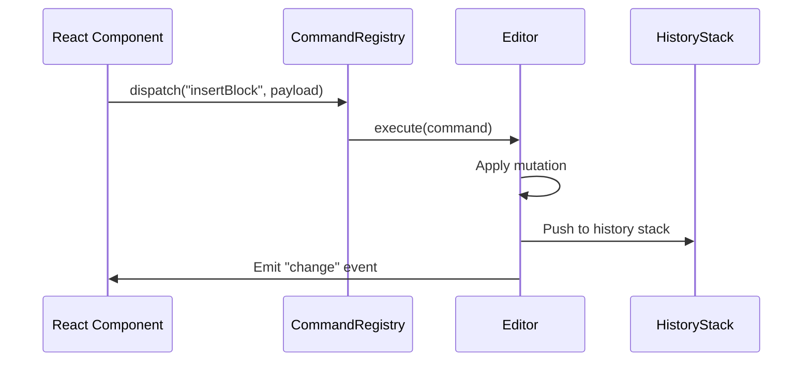

# Commands

The Command pattern is the primary mechanism for mutating the document model, executing UI actions, and enabling undo/redo.

---

## Core Concept

Every user action that changes state is encapsulated as a `Command` object. This provides:

- **Undo/Redo**: If a command defines `undo()`, the editor can revert it.
- **Transaction History**: A log of all executed commands for debugging and replay.
- **Decoupling**: UI components trigger commands without knowing the internal state logic.

---

## Command Interface

```ts
interface Command<T = unknown> {
  id: string;
  execute(): T;
  undo?(): void;
  redo?(): void; // Optional; often the same as execute
}
```

---

## Registry

Commands are registered in a `CommandRegistry`. The registry maps command IDs to factory functions.

```ts
CommandRegistry.register("insertBlock", (payload) => new InsertBlockCommand(payload));
```

---

## Execution Flow



---

## Built-in Commands

| Command | Description | Undoable |
|---|---|---|
| `InsertBlockCommand` | Adds a block at a specific index | Yes |
| `RemoveBlockCommand` | Deletes a block by ID | Yes |
| `UpdateBlockCommand` | Updates properties of a block | Yes |
| `MoveBlockCommand` | Moves a block within the tree | Yes |
| `DuplicateBlockCommand` | Duplicates an existing block | Yes |
| `SetSelectionCommand` | Updates the current selection | No |
| `TransactionCommand` | Batches multiple commands into one atomic unit | Yes |

### Example: InsertBlockCommand

```ts
class InsertBlockCommand implements Command {
  id = "insertBlock";
  private previousState: AtlasDocument;

  constructor(private editor: Editor, private block: BlockNode, private index: number) {}

  execute() {
    this.previousState = this.editor.getDocument();
    this.editor.applyTransaction((tr) => {
      tr.insertBlock(this.block, this.index);
    });
  }

  undo() {
    this.editor.setDocument(this.previousState);
  }
}
```

---

## Best Practices

1. **Never mutate the document directly from a component.** Always dispatch a command.
2. **Keep commands granular.** For complex operations, use a `TransactionCommand` to batch several smaller commands.
3. **Always provide `undo()` for state-mutating commands.** UI-only commands (like focusing a different block) should not be undoable.
4. **Avoid side effects in `execute()`.** Commands should be pure with respect to the document model.
