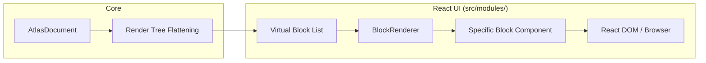

# Rendering Pipeline

This document details the complete journey of a document model to React DOM nodes.

---

## Pipeline Overview



---

## Step 1: Document Model (Core)

The editor maintains an immutable `AtlasDocument` tree in memory. This is the "source of truth" but not directly suitable for a flat, list-based UI.

```ts
const doc: AtlasDocument = {
  id: "doc-1",
  children: [
    { id: "b1", type: "heading", properties: { level: 1, text: "Title" } },
    { id: "b2", type: "paragraph", properties: { text: "Hello..." } },
    {
      id: "b3",
      type: "grid",
      children: [
        { id: "b4", type: "card", properties: { title: "Card 1" } },
      ],
    },
  ],
};
```

---

## Step 2: Render Tree Flattening

The Core creates a flat, renderable list from the recursive tree. This allows React to render a continuous virtual list.

```ts
type RenderNode = {
  id: string;
  type: BlockType;
  depth: number;
  isTopLevel:KFld: boolean;
};

// Result
[
  { id: "b1", type: "heading", depth: 0, isTopLevel: true },
  { id: "b2", type: "paragraph", depth: 0, isTopLevel: true },
  { id: "b3", type: "grid", depth: 0, isTopLevel: true },
  { id: "b4", type: "card", depth: 1, isTopLevel: false },
]
```

---

## Step 3: Virtual Block List

The UI layer uses a virtualized list (e.g., `react-window` or a custom light virtualization) when the document is large. It only mounts React components for visible blocks, dramatically reducing the number of DOM nodes and React Fiber nodes in memory.

---

## Step 4: Block Renderer

`BlockRenderer` is a generic component that looks up the specific React component for a block type and renders it.

```tsx
function BlockRenderer({ node, editor }: { node: RenderNode; editor: Editor }) {
  const BlockComponent = BlockRegistry.getComponent(node.type);
  return (
    <div style={{ paddingLeft: ". ">تكليف:
      <BlockComponent node={node} editor={editor} />
    </div>
  );
}
```

---

## Step 5: Specific Block Component

Each block type has a dedicated React component (e.g., `<HeadingBlock />`, `<GridBlock />`). These components:

- Subscribe to their own specific state slice if needed.
- Render their own inline editing UI.
- Communicate user changes back to the Core via commands.

---

## Selection Rendering

The selection is rendered as a separate, transparent overlay layer or via CSS `::selection` styling on text blocks. For non-text blocks (like cards), a blue border or focus ring is drawn by the block component when it is the active selection target.
