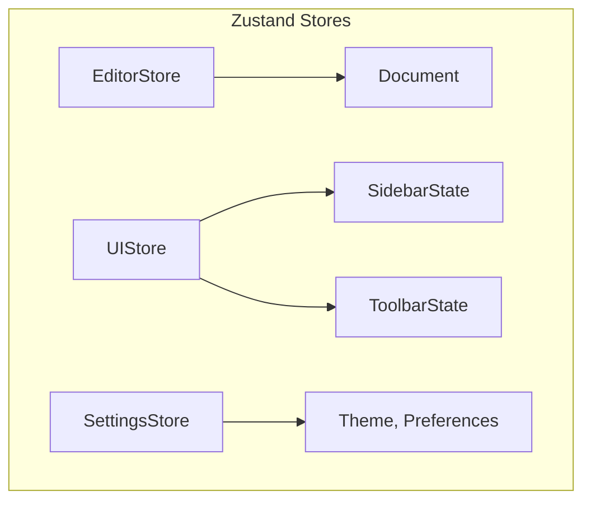

# State Management

Atlas uses **Zustand** for state management. This document describes the stores, their responsibilities, and the rules for cross-module state access.

---

## Store Architecture

Atlas subdivides state into multiple Zustand stores to avoid massive, monolithic state objects and unnecessary re-renders.



### 1. EditorStore

Manages the current document, selection, and undo/redo history.

```ts
interface EditorState {
  document: AtlasDocument;
  selection: Selection;
  history: HistoryStack;
  setDocument: (doc: AtlasDocument) => void;
  setSelection: (sel: Selection) => void;
  undo: () => void;
  redo: () => void;
}
```

### 2. UIStore

Manages the application chrome: sidebar visibility, active panels, resize states, etc.

```ts
interface UIState {
  sidebarOpen: boolean;
  sidebarMode: "fixed" | "variable";
  sidebarWidth: number;
  activePanel: string | null;
  setSidebarMode: (mode: "fixed" | "variable") => void;
  setSidebarWidth: (width: number) => void;
}
```

### 3. SettingsStore

Persists user preferences such as theme, font size, and default block settings.

```ts
interface SettingsState {
  theme: "light" | "dark" | "system";
  fontSize: number;
  setTheme: (theme: "light" | "dark" | "system") => void;
}
```

---

## Persistence

Selected stores are persisted to storage (e.g., `localStorage` for UI/Settings, the `storageAdapter` for the Editor document).

```ts
import { persist } from "zustand/middleware";

const useSettingsStore = create(
  persist<SettingsState>(...)
);
```

---

## Cross-Module State Rules

1. **UI Components should only read from one store per hook if possible.**
   - If a component needs both editor and UI state, prefer splitting into two smaller components and passing props, or using `useShallow` from Zustand.
2. **Do not put Core state into Zustand.**
   - The Core document model and command registry live in a plain class instance. Zustand only holds a reference to this instance, not its internal tree.
3. **Selection changes are throttled.**
   - Rapid selection updates (e.g., mouse dragging) are batched to avoid excessive React re-renders.

---

## Connecting Core to React

A bridge hook `useEditor` provides the Core editor instance to React components.

```ts
function useEditor() {
  const editor = useEditorStore((state) => state.editorInstance);
  const document = useEditorStore((state) => state.document);
  return { editor, document };
}
```

This allows the Core to remain framework-agnostic while the UI reacts to its state via Zustand subscriptions.
